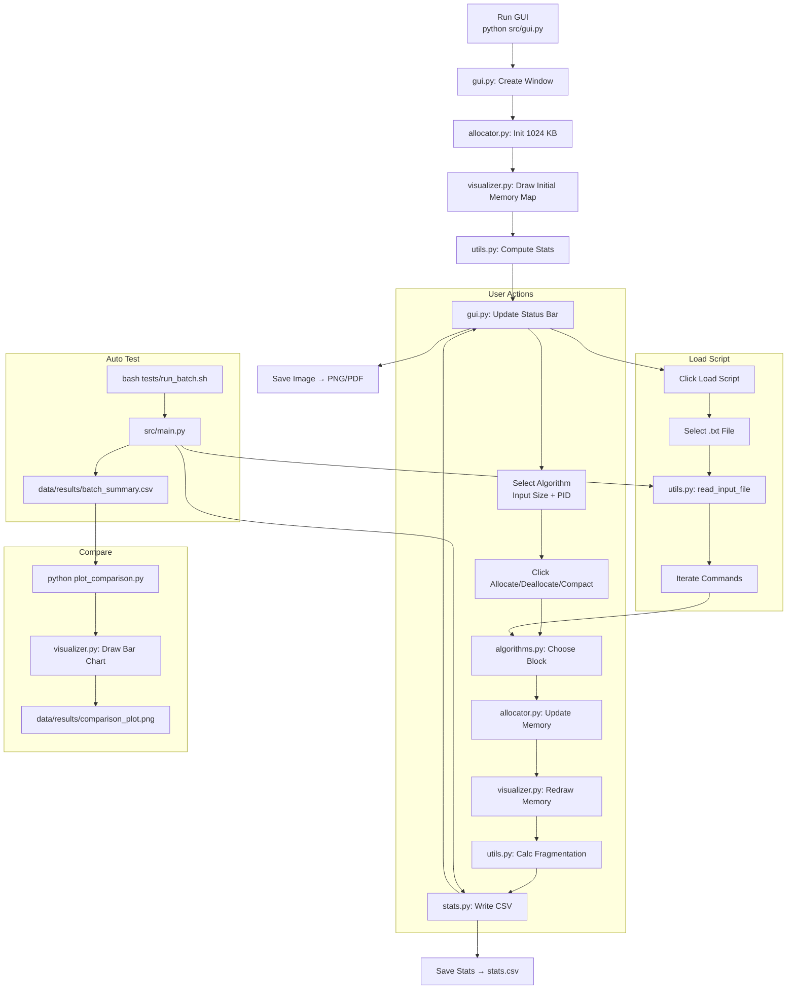

# Memory Allocator Simulator

**Ứng dụng mô phỏng cấp phát bộ nhớ** với **giao diện GUI trực quan**, hỗ trợ **4 thuật toán**, **chạy script tự động**, **xuất ảnh & thống kê**, **so sánh hiệu suất bằng biểu đồ**.

> **Môn học**: Hệ điều hành  
> **Lớp**: SE2039  
> **Ngôn ngữ**: Python 3.8+  
> **GUI**: `tkinter` + `matplotlib` (Tcl/Tk 8.6)  
> **Hệ điều hành**: Windows, Ubuntu, macOS

---

## 🔄 Flow tổng thể (Mermaid)



---

## 🖼 GUI Preview


---

## ✅ Tính năng nổi bật

| Tính năng | Mô tả |
|---------|------|
| **GUI Live View** | Hiển thị bộ nhớ theo thời gian thực |
| **4 thuật toán** | First Fit, Next Fit, Best Fit, Worst Fit |
| **Status Bar** | Fragmentation % với **màu cảnh báo (xanh/cam/đỏ)** |
| **Load Script** | Chạy file `.txt` tự động |
| **Compact Animation** | Hiệu ứng trượt mượt khi nén bộ nhớ |
| **Save Image / Stats** | Xuất PNG, PDF, CSV |
| **So sánh hiệu suất** | `plot_comparison.py` vẽ biểu đồ cột |
| **Test tự động** | `run_batch.sh` chạy tất cả script |

---

## 📁 Cấu trúc thư mục

```
Memory_Allocator/
├── README.md
├── Requirements.txt
├── plot_comparison.py        ← Vẽ biểu đồ so sánh
├── requirements.txt
├── data/
│   └── results/              ← [Tự tạo] PNG, CSV, stats.csv
├── src/
│   ├── algorithms.py         ← Triển khai 4 thuật toán
│   ├── allocator.py          ← Core: quản lý bộ nhớ
│   ├── gui.py                ← Giao diện chính (tkinter + matplotlib)
│   ├── main.py               ← CLI entry (dùng cho batch test)
│   ├── stats.py              ← Ghi thống kê vào CSV
│   ├── utils.py              ← Đọc script, tính fragmentation
│   └── visualizer.py         ← Hỗ trợ vẽ biểu đồ
├── tests/
│   ├── run_batch.sh          ← Chạy tất cả script test
│   └── scripts/
│       ├── compaction_test.txt
│       ├── multitasking.txt
│       ├── producer_consumer.txt
│       ├── sample.txt
│       └── web_server.txt
```

---

## 🔧 Cài đặt

### ✅ Ubuntu

```bash
# Cài tkinter (Tcl/Tk 8.6)
sudo apt update
sudo apt install python3-tk -y

# Tạo môi trường ảo
python3 -m venv venv
source venv/bin/activate

# Cài thư viện
pip install -r requirements.txt

# Chạy GUI
python src/gui.py
```

### ✅ Windows

```cmd
python -m venv venv
venv\Scripts\activate
pip install -r requirements.txt
python src\gui.py
```

> `tkinter` đi kèm Python trên Windows → không cần cài thêm  

---

## ▶️ Chạy chương trình

### ✅ 1) Giao diện GUI
```bash
python src/gui.py
```

### ✅ 2) Chạy tất cả test tự động
```bash
bash tests/run_batch.sh
```

### ✅ 3) Vẽ biểu đồ so sánh hiệu suất
```bash
python plot_comparison.py
```

---

## 📜 Dùng Script Test

### ✅ Cách 1: Trong GUI
- Nhấn **Load Script**
- Chọn file trong `tests/scripts/`

### ✅ Cách 2: Dùng CLI
```bash
python src/main.py --script tests/scripts/web_server.txt --algo best_fit
```

---

## 📄 File script mẫu

`tests/scripts/sample.txt`

```
allocate 200 P1
allocate 300 P2
deallocate P1
allocate 150 P3
compact
allocate 100 P4
show_stats
```

---

## 📂 Kết quả xuất ra

| Hành động | File tạo |
|----------|---------|
| Save Image | `data/results/first_fit_2025...png` |
| Save Stats | `data/results/stats.csv` |
| Batch Test | `data/results/batch_summary.csv` |
| So sánh | `data/results/comparison_plot.png` |

---

## 📊 So sánh hiệu suất

```bash
python plot_comparison.py
```
→ Tạo biểu đồ: **Fragmentation % trung bình theo thuật toán**

---

## 🖥️ Giao diện GUI

> (Ảnh demo)
```

```

> (Tự động lưu khi nhấn "Save Image")

---

## ✅ Không sinh file `.pyc`
- `pyproject.toml` → ngăn tạo `__pycache__`
- `.gitignore` → không commit file rác

---

## 👤 Tác giả

| Thông tin | Nội dung |
|----------|---------|
| Họ tên | *[Tên sinh viên]* |
| MSSV | *[Mã số]* |
| Email | *[email@edu.vn]* |

---

## 📄 License

MIT

